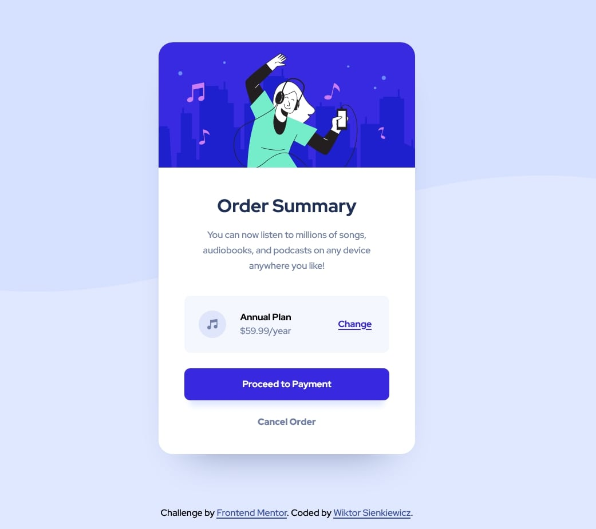

# Frontend Mentor - Order summary card solution

This is a solution to the [Order summary card challenge on Frontend Mentor](https://www.frontendmentor.io/challenges/order-summary-component-QlPmajDUj). Frontend Mentor challenges help you improve your coding skills by building realistic projects. 

## Table of contents

- [Overview](#overview)
  - [The challenge](#the-challenge)
  - [Screenshot](#screenshot)
  - [Links](#links)
- [My process](#my-process)
  - [Built with](#built-with)
  - [What I learned](#what-i-learned)
  - [Continued development](#continued-development)
  - [Useful resources](#useful-resources)
- [Author](#author)

## Overview

### The challenge

Users should be able to:

- See active states for interactive elements

### Screenshot

### Links

<!-- - Solution URL: [Add solution URL here](https://your-solution-url.com) -->
- Live Site URL: [wiksien.github.io](https://wiksien.github.io/)

## My process

### Built with

- Semantic HTML5 markup
- SASS
- Flexbox
- CSS Grid
- Custom fonts
- Love and care

### What I learned

I refreshened my knowledge about HTML and CSS, especially using SASS. I learned how custom fonts work and how to apply them in my websites. I improved my workflow within my IDE, Visual Studio Code.

### Continued development

In my future projects I defenetly want to take more care in naming SASS variables more accordingly and also seprate them into a different file to improve code readability. I would also like to explore using custom fonts in my projects more, I think they give a lot of personality to the website. Finally, I would like to include more JS into my future projects.

### Useful resources

- [A Complete Guide to Flexbox](https://css-tricks.com/snippets/css/a-guide-to-flexbox/) - This helped me to quickly get information about what I need to do in order to complete a particular task using Flexbox. Great source of knowledge, I love how every property has a nice graphic to show what it does.
- [A Complete Guide to Grid ](https://css-tricks.com/snippets/css/complete-guide-grid/) - This helped me in the same way as Complete Guide to Flexbox, but with grid. Great source.
- [MDN Web Docs](https://developer.mozilla.org/en-US/) - This helped me to get information about little stuff I forgot like shorthands ect. Another great source, I really like the this documentation is written, it is very understandable and makes all the specyfic information I need easly accessible.

## Author

- Wiktor Sienkiewicz
- Frontend Mentor - [@wiksien](https://www.frontendmentor.io/profile/wiksien)